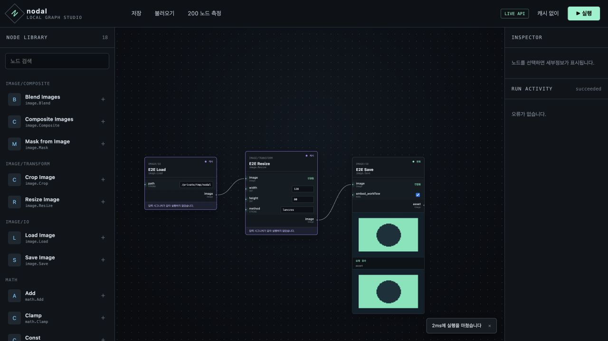

# nodal

로컬에서 돌아가는 **노드 기반 이미지 생성 워크스테이션**. ComfyUI 와 같은 종류의 도구를,
그 코드를 한 줄도 보지 않고 처음부터 다시 설계한 것이다.

캔버스에 노드를 놓고 소켓을 연결해 그래프를 만들면, 실행 엔진이 필요한 노드만 위상 정렬해서
돌린다. 입력 하나를 바꾸면 **그 아래만** 다시 실행된다.

> **비공개 저장소다.** 개별적으로 공유받아 읽고 있다면, 이 문서 하나로 실행까지 가는 것이
> 목적이다. 막히는 곳이 있으면 그건 문서의 버그다.

---

## 왜 다시 만드는가

ComfyUI 는 훌륭하게 동작하지만 몇 가지가 초기 설계에 박혀 있어 고치기 어렵다.
nodal 은 그 지점들을 처음부터 다르게 잡았다.

| | ComfyUI | nodal |
|---|---|---|
| 소켓 타입 | 자유 문자열 (`"IMAGE"`) | 구조화된 타입 서술자. 와일드카드도 1급 타입 |
| 노드 정의 | 딕셔너리-튜플 스키마 | 선언형 클래스 + 타입 힌트 |
| 노드 ID | 순번 문자열 (`"3"`, `"7"`) | UUID |
| 캐시 키 | 노드 ID 기반 | **입력 시그니처** 기반 |
| 그래프 포맷 | 실행용 / UI용 두 벌 | 한 벌. UI 상태는 같은 문서의 `ui` 필드에 격리 |
| 모델 계층 | 직접 구현 | `diffusers` 에 위임 |

라이선스도 다르다 — ComfyUI 는 GPL-3.0, nodal 은 **Apache-2.0** 이다.
그래서 ComfyUI 코드는 참고조차 하지 않는다 (`NOTICE-provenance.md` 가 기록으로 남아 있다).

---

## 지금 무엇이 되는가

M7까지 사람 완료 판정이 끝났다. 로드맵에서 아직 비어 있는 것은 M3 후속 UX 1개와
MVP를 막지 않는 M5 최적화 2개다.

### ✅ 되는 것

- **그래프 편집기** — React Flow 캔버스. 노드 생성·연결·삭제·이동, 더블클릭 퍼지 검색
  (한글 별칭 지원), 드래그 중 타입이 호환되는 소켓만 밝게 표시, 저장/불러오기
- **실행 엔진** — 출력 노드에서 역방향으로 필요한 것만 실행, 사이클 탐지, 다이아몬드 의존성,
  입력 시그니처 기반 LRU 캐시, 동기/비동기 노드 자동 감지, 실행 중 취소
- **실시간 상태** — WebSocket 으로 노드별 대기/실행/캐시/에러 색상이 즉시 바뀐다
- **이미지 노드 7종** — Load · Save · Resize · Crop · Blend · Mask · Composite.
  노드 안에 이미지 프리뷰가 그려진다
- **Diffusion 노드** — 체크포인트·텍스트 인코딩·샘플링·VAE 디코드·LoRA. 무거운
  torch/diffusers 런타임은 CPU와 NVIDIA CUDA 중 명시적으로 골라 설치한다
- **조건 분기·배치·서브그래프** — 실행하지 않을 브랜치를 차단하고, 서브그래프는
  검증·실행 전에 캐논 그래프로 평탄화한다
- **PNG 워크플로 임베딩** — Save 한 PNG 의 `iTXt` 청크에 그래프가 UTF-8 로 들어간다.
  그 PNG 를 캔버스에 **드래그앤드롭하면 워크플로가 그대로 복원된다**
- **MCP 자동화** — 템플릿별 툴, 비동기 실행과 폴링, 이미지 에셋 업로드·참조. MCP와
  REST가 같은 서버·레지스트리·실행 큐를 쓴다
- **확장 노드 팩** — `~/.nodal/extensions`의 매니페스트와 Python 노드를 자동 발견하고,
  실패한 확장은 다른 확장을 막지 않은 채 API와 UI 배너에 원인을 남긴다
- **Undo/redo와 복구 리비전** — 노드 저작 변경을 되돌리고 OPFS에 최근 캐논 그래프
  리비전을 남긴다
- **CLI** — `nodal run`으로 UI 없이 그래프를 실행한다. 어느 노드가 캐시로 스킵됐는지
  기호로 보인다
- **에러 메시지** — 항상 **어느 노드의 어느 소켓**인지 지목한다. 익명 에러가 없다

### ❌ 아직 안 되는 것

솔직하게 적는다. 현재 경계는 다음과 같다.

- **프론트 커스텀 위젯 API가 없다.** 확장 ESM의 URL 제공·1회 평가·실패 배너는
  동작하지만, 모듈이 호출할 등록 함수와 마운트·해제 수명주기는 정하지 않았다.
  `globalThis`나 임의 DOM 변경은 지원되는 확장 방법이 아니다
- **확장 매니페스트의 Python 의존성을 자동 설치하지 않는다.** nodal 자체만 쓰는
  노드 팩은 설치할 수 있지만, `[dependencies].python`을 해석해 환경에 넣는 경로는 없다
- **런처는 서명된 독립 실행 파일이 아니다.** 공유받은 체크아웃에서 설치·빌드·실행을
  한 번에 수행하는 스크립트이므로 `uv`와 Node.js가 필요하다
- **원격 공개용 인증이 없다.** 기본 `127.0.0.1` 로컬 바인딩을 유지한다. 인증 없이
  `0.0.0.0`으로 열지 않는다
- lazy 입력과 실행 중 동적 노드 확장은 MVP 밖이다. 서브그래프는 로드 시 평탄화한다
- **한국어 UI 만 있다.** i18n 은 로드맵에 없다

---

## 5분 안에 실행하기

### 준비물

| 도구 | 버전 | 비고 |
|---|---|---|
| [`uv`](https://docs.astral.sh/uv/) | 최신 | Python 은 `uv` 가 알아서 받아온다. 직접 설치할 필요 없다 |
| Node.js | 20+ | |
| Corepack | Node.js에 포함 | 저장소가 선언한 pnpm 버전을 실행한다 |

GPU는 필수가 아니다. 첫 실행에서 `core`·`cpu`·`cuda` 중 하나를 고르고
`~/.nodal/runtime`에 저장한다. 비대화형 첫 실행의 기본은 `core`이며 torch를 설치하지
않는다. 선택한 모드는 시작할 때 항상 출력된다.

### 1. 원클릭 실행

macOS에서는 `launch-nodal.command`, Windows에서는 `launch-nodal.bat`, Linux에서는
`launch-nodal.sh`를 실행한다. 처음 한 번 Python 환경 동기화와 프론트 빌드를 수행한 뒤
백엔드·웹 UI·MCP를 `127.0.0.1:8188`의 같은 프로세스에서 띄우고 브라우저를 연다.

터미널에서 모드를 지정할 수도 있다.

```bash
./launch-nodal.command --runtime core   # torch 없음
./launch-nodal.command --runtime cpu    # CPU torch + diffusers
./launch-nodal.command --runtime cuda   # NVIDIA CUDA (Mac에서는 명시적으로 실패)
```

Windows:

```powershell
.\launch-nodal.bat --runtime cuda
```

사용자 데이터는 저장소 밖의 `~/.nodal/`에 남는다.

```text
~/.nodal/
├── assets/
├── extensions/
├── models/
├── templates/
└── runtime
```

런처 없이 개발 명령을 직접 쓰려면 [`docs/dev.md`](docs/dev.md)를 따른다. 두
락파일(`uv.lock`, `pnpm-lock.yaml`)이 설치 버전을 고정한다.

Mac에서 실제 설치·빌드·UI/API 실행을 확인했고, 2026-08-31 사람이 크로스플랫폼
패키징을 포함한 M7 완료를 판정했다. 재검증 절차는 `docs/dev.md`에 유지한다.

### 2. 수동 실행: 백엔드 서버

원클릭 런처를 썼다면 아래 2·3단계는 건너뛴다. 개발 중 프로세스를 따로 띄울 때만 쓴다.

```bash
uv run nodal serve
```

등록된 노드 수와 `http://127.0.0.1:8188/docs`가 찍히면 성공이다.
`/docs` 에서 REST API 를 바로 눌러볼 수 있다.

> Save 한 이미지를 디스크에 남기려면 `uv run nodal serve --assets ./assets` 로 띄운다.
> 안 주면 메모리에만 있다가 서버를 끄면 사라진다 (시작할 때 알려준다).

### 3. 프론트엔드 개발 서버 — **개발할 때만 새 터미널에서**

```bash
pnpm --filter @nodal/web dev
```

원클릭 런처는 빌드된 프론트를 8188에서 함께 내므로 이 단계가 필요 없다. 프론트 코드를
수정할 때만 http://localhost:5173 을 열며, 우상단에 **`LIVE API`** 배지가 보이면 실서버에 붙은 것이다.
(백엔드 없이 화면만 보고 싶으면 `VITE_NODAL_API_MODE=mock` 을 앞에 붙인다.)

여기까지 왔으면 아래 두 예제를 그대로 따라 해볼 수 있다.

---

## 이렇게 써보세요

### A. CLI 로 실행 엔진의 요점 보기 — 1분

이 저장소에서 가장 중요한 것은 캐시다. `examples/arithmetic.nodal.json` 은 그것을
눈으로 보여주려고 만든 그래프다 (다이아몬드 의존성 + 실행되지 않는 노드 포함).

```bash
uv run nodal run examples/arithmetic.nodal.json --twice --set offset.value=10
```

`--twice` 는 **같은 캐시로 두 번** 돌리고, `--set` 은 2회차에만 적용된다.
그래서 출력이 이렇게 나온다:

```
▶ 실행 시작 (11개 노드)
  ● offset 실행
  ● seed 실행
  ...

▶ 같은 캐시로 재실행 (offset.value=10 적용)
  ● offset 실행
  ◌ seed 캐시 히트 — 건너뜀
  ◌ doubled 캐시 히트 — 건너뜀
  ● shifted 실행
  ◌ squared 캐시 히트 — 건너뜀
  ● gap 실행
  ...

결과
  report.text = '최종 결과: 36'

실행 8 · 캐시 3 · 0ms
```

**`◌` 가 캐시 히트, `●` 가 실행이다.** `offset` 을 바꿨더니 그 아래(`shifted` → `gap` → …)만
다시 돌고, 무관한 `seed` · `doubled` · `squared` 는 건너뛴다. 캐시 키가 노드 ID 가 아니라
**입력 시그니처**라서 가능한 동작이다.

그래프에 있는 `unused` 노드는 어느 실행에도 나타나지 않는다 — `outputs` 에 기여하지 않으니
엔진이 아예 건드리지 않는다.

같이 볼 만한 것:

```bash
uv run nodal validate examples/arithmetic.nodal.json   # 실행 없이 검증만
uv run nodal nodes 곱하기                               # 한글 별칭으로 노드 검색
uv run nodal nodes                                      # 등록된 노드 전부
```

### B. 브라우저에서 이미지 워크플로 — 3분

1. 상단 **불러오기** 를 눌러 `examples/image.nodal.json` 을 연다.
   **Load → Resize → Save** 세 노드가 연결된 채로 캔버스에 뜬다
2. 우상단 **실행** 을 누른다. 노드 상태 색이 실행 → 성공으로 바뀌고, **각 노드 안에
   이미지 프리뷰가 그려진다** — 512×512 샘플이 256×256 으로 줄어든 것이 보인다
3. 다시 **실행** 을 누르면 `Load` 와 `Resize` 는 `캐시` 로 넘어간다.
   `Save` 는 부수효과라 캐시하지 않으므로 매번 실행된다



*입력이 바뀌지 않은 Load와 Resize는 건너뛰고, 부수효과가 있는 Save만 다시 실행한다.*

읽어들이는 `examples/sample.png` 는 색 밴드 · 그라디언트 · 원 · 체커보드로 이루어진
테스트 패턴이다. 축소했을 때 무엇이 달라지는지 보이라고 그렇게 만들었다
(`tools/make_example_image.py` 가 생성한다 — 외부에서 가져온 이미지가 아니다).

여기서부터는 직접 만져본다. `Load` 노드의 `path` 를 다른 이미지로 바꾸거나,
`Resize` 의 `width`/`height` 를 조절하거나, 팔레트에서 **Crop · Blend · Composite** 를
가져와 붙여본다. 팔레트 항목은 **캔버스로 끌어다 놓거나 더블클릭**하면 추가되고,
캔버스 빈 곳을 더블클릭하면 퍼지 검색이 열린다 — `이미지`, `크기` 같은 한글 별칭도 찾는다.
소켓을 드래그하는 동안 **타입이 호환되는 소켓만 밝게** 표시된다.

**그리고 여기가 재미있는 부분** — `Save` 한 PNG 를 캔버스에 **드래그앤드롭** 하면
그래프가 통째로 복원된다. 워크플로가 PNG 의 `iTXt` 메타데이터 안에 UTF-8 로 들어 있어서,
이미지 파일 자체가 재현 가능한 레시피가 된다.

같은 그래프를 CLI 로도 돌릴 수 있다. `--assets` 를 주면 결과 PNG 가 디스크에 남는다:

```bash
uv run nodal run examples/image.nodal.json --assets ./assets
```

---

## 검사 돌려보기

전부 통과하는 상태로 공유했다. 확인하고 싶으면:

```bash
tools/ci-local.sh
```

`.github/workflows/ci.yml` 을 **파싱해서** 거기 있는 명령을 그대로 실행한다 —
CI 의 복사본이 아니라서 어긋나지 않는다. 로컬 대응물이 없는 단계는 무엇을 왜 건너뛰었는지
끝에 나열한다.

---

## 저장소 구조

```
packages/core          # 그래프 엔진. torch 도 이미지도 모른다. 도메인 중립
packages/server        # FastAPI — REST + WebSocket
packages/nodes-core    # 기본 노드 팩 (수학·문자열) + `nodal` CLI
packages/nodes-image   # 이미지 노드 팩 (numpy · Pillow 는 여기에만 있다)
packages/nodes-diffusion # diffusion 노드 팩 (torch 런타임은 옵트인)
apps/web               # Vite + React 프론트엔드
schemas/               # 생성된 JSON Schema · OpenAPI (손으로 고치지 않는다)
examples/              # 예제 그래프 + 샘플 이미지
tools/                 # 개발 스크립트 (CI 재현, 스키마 생성, 샘플 이미지 생성)
launch-nodal.*          # macOS · Windows · Linux 원클릭 래퍼
```

의존성은 **한 방향으로만** 흐른다:

```
apps/web  →  packages/server  →  packages/core
packages/nodes-*  →  packages/core
```

`packages/core` 는 torch 도, server 도, 노드 팩도 import 하지 않는다. 사람이 지키는 게
아니라 `ruff` 의 `banned-api` 규칙이 거부한다.

---

## 문서 안내

**읽는 순서대로** 적었다.

| 파일 | 무엇 | 읽어야 하나 |
|---|---|---|
| [`docs/design.md`](docs/design.md) | 아키텍처 · 데이터 모델 · 실행 엔진 · API 스펙 | **설계가 궁금하면 여기.** 이 저장소에서 가장 내용이 많은 문서다 |
| [`docs/roadmap.md`](docs/roadmap.md) | M0~M7 마일스톤과 완료 기준 | **진행 상황이 궁금하면 여기.** 체크박스는 사람 판정 상태다 |
| [`docs/dev.md`](docs/dev.md) | 로컬에서 무엇을 실행하는지 | 직접 만져볼 거면 |
| [`docs/node-authoring.md`](docs/node-authoring.md) | 서드파티 Python 노드 팩 작성·설치 | 노드 팩을 만들 거면 |
| [`docs/decisions.md`](docs/decisions.md) | 설계 판단 변경 로그 | "왜 이렇게 했지?" 싶을 때 |
| [`docs/license.md`](docs/license.md) | Apache-2.0 선택 근거 | 라이선스가 궁금하면 |

### 사람은 안 읽어도 되는 파일

- **[`AGENTS.md`](AGENTS.md) · [`CLAUDE.md`](CLAUDE.md) — 코딩 에이전트용 지침이다.**
  이 저장소는 Claude Code 와 Codex 가 함께 작업했고, 두 에이전트가 서로 밟지 않게 하려고
  둔 규칙이다. 사람이 코드를 이해하는 데는 필요 없다. (다만 "ComfyUI 코드를 절대
  복사하지 않는다"가 왜 절대 규칙인지는 궁금하면 볼 만하다.)
- **`NOTICE-provenance.md`** — 외부 프로젝트를 아키텍처 수준에서만 참조했다는 내부 기록.
  법적 방어용이지 읽을거리가 아니다.

---

## 라이선스

**[Apache-2.0](LICENSE)** — 저작권자 정태우 (twcheong99@gmail.com).
귀속 고지는 [`NOTICE`](NOTICE) 에 있다.

MIT 가 아니라 Apache-2.0 인 이유는 **명시적 특허 허여(§3)** 다. 이미지 생성은 특허 활동이
활발한 영역이라 기여자로부터 특허 라이선스를 함께 받아두는 쪽이 채택자에게 안전하다.
전체 근거와 검토했다 탈락한 선택지들은 [`docs/license.md`](docs/license.md) 에 있다.

의존성은 전부 허용적 라이선스(MIT · Apache-2.0 · BSD · HPND)로 유지한다.
**GPL/AGPL 의존성은 추가하지 않는다** — CI 의 `licence-guard` 잡이 강제한다.
